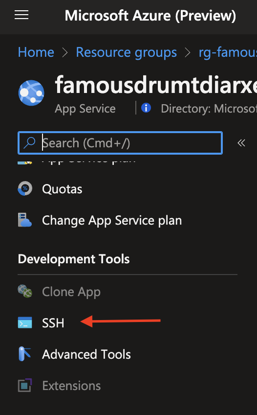
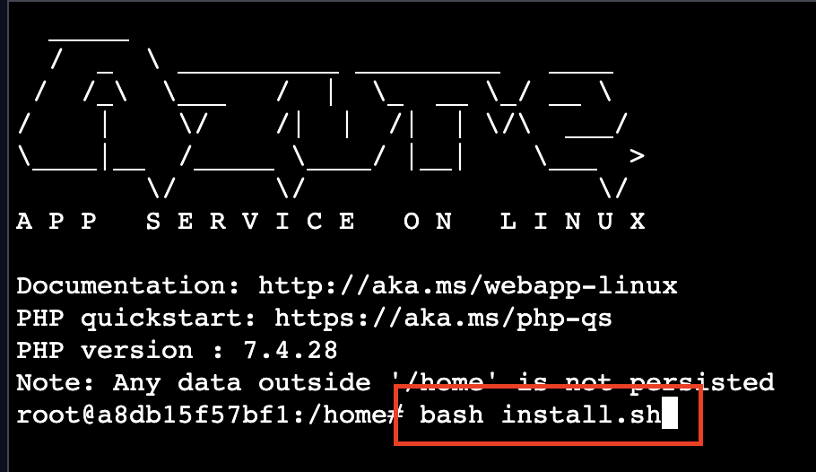

# Azure Bicep Template for REDCap automated deployment in Azure

## Quick Start

### Manual deployment

Prerequisites

- [PowerShell 7](https://learn.microsoft.com/powershell/scripting/install/installing-powershell?view=powershell-7.3)
- [Az PowerShell module](https://learn.microsoft.com/powershell/azure/new-azureps-module-az?view=azps-10.3.0)

To perform a manual deployment:

- Fork this repo to your own account and clone it, or simply clone this repo to an admin workstation.
- Open the folder where you cloned the repo.
- Copy `main-sample.bicepparam` to a new file with a descriptive name, such as `main-*yourorg*.bicepparam`.
- Review and modify the parameter values.
- Execute `deploy.ps1` as shown below.

```PowerShell
./deploy.ps1 -Location 'eastus' -TemplateParameterFile 'main-yourorg.bicepparam' -SubscriptionId 'subscription-id'
```

You may omit the parameter names and use them in the order `Location`, `TemplateParameterFile`, and `SubscriptionId`

```PowerShell
./deploy.ps1 'eastus' 'main-yourorg.bicepparam' 'subscription-id'
```

### CI/CD Deployment with GitHub

Information pending

### CI/CD Deployment with Azure DevOps

Information pending

<!--
| Description | Link  | Azure US Gov Link |
| --- | --- | --- |
| Deploy with your SMTP Relay | [](https://portal.azure.com/#create/Microsoft.Template/uri/https%3A%2F%2Fraw.githubusercontent.com%2Fmicrosoft%2Fazure-redcap-paas%2Fmain%2Fazuredeploy.json)               | [](https://portal.azure.us/#create/Microsoft.Template/uri/https%3A%2F%2Fraw.githubusercontent.com%2Fmicrosoft%2Fazure-redcap-paas%2Fmain%2Fazuredeploy.json) |
| Deploy using SendGrid       | [](https://portal.azure.com/#create/Microsoft.Template/uri/https%3A%2F%2Fraw.githubusercontent.com%2Fmicrosoft%2Fazure-redcap-paas%2Fmain%2Fazuredeploy_with_SendGrid.json) | [](https://portal.azure.us/#create/Microsoft.Template/uri/https%3A%2F%2Fraw.githubusercontent.com%2Fmicrosoft%2Fazure-redcap-paas%2Fmain%2Fazuredeploy_with_SendGrid.json) |
-->

### Details

This template automates the deployment of the REDCap solution into Azure using managed PaaS resources. The template assumes you are deploying a version of REDCap that supports direct connection to Azure Blob Storage. If you deploy an older version, deployment will succeed but you will need to manually provision NFS storage in Azure, and delete the new storage account. For NFS, consider:

- <https://learn.microsoft.com/azure/azure-netapp-files/>
- <https://azuremarketplace.microsoft.com/marketplace/apps/softnas.buurst_nas>
- <https://learn.microsoft.com/samples/azure/azure-quickstart-templates/nfs-ha-cluster-ubuntu/>

To deploy the REDCap source to Azure App Service, you must supply your REDCap Community site credentials. The deployment automation will use them to pull the REDCap source directly from the community site.

> NOTE: These values will be stored within the Azure App Service as configuration settings. Once your deployment has succeeded, you should navigate to your Azure App Service resource and delete or clear the values so that they aren't stored here.


<https://projectredcap.org/wp-content/resources/REDCapTechnicalOverview.pdf>

- The template deploys the following:
  - Azure Web App
  - Azure DB for MySQL (1)
  - Azure Storage Account
  - Key Vault
  - Private DNS zones
  - Virtual Network
  - Application Insights
  <!-- - (optional) SendGrid 3rd Party Email service (2) -->

(1) Review <https://learn.microsoft.com/azure/mysql/flexible-server/concepts-service-tiers-storage> for details on available features, regions, and pricing models for Azure DB for MySQL.

<!--(2) SendGrid is a paid service with a free tier offering 25k messages per month, with additional paid tiers offering more volume, whitelisting, custom domains, etc. There is a limit of two instances per subscription using the free tier. For more information see <https://docs.microsoft.com/en-us/azure/store-sendgrid-php-how-to-send-email#create-a-sendgrid-account>. The service will be accessed initially using the password you enter in the deployment template. You can click "Manage" on the SendGrid service after deployment to administrate the service in their portal, including options to create an API key that can be used for access instead of the password.

If after deployment, you would instead like to use a different SMTP relay, edit the values "smtp_fqdn_name", "smtp_port", "smtp_user_name", and "smtp_password" to point to your preferred endpoint. You can then delete the SendGrid service from this resource group.

If you use Exchange Online (part of the Microsoft 365 Suite), you can follow these steps to set it up and use it as an SMTP relay for this service: <https://learn.microsoft.com/Exchange/mail-flow-best-practices/how-to-set-up-a-multifunction-device-or-application-to-send-email-using-microsoft-365-or-office-365> -->

### Setup

This template will automatically deploy the resources necessary to run REDCap in Azure using PaaS (Platform-as-a-Service) features.

**IMPORTANT**: _The "Workload Name" you choose will be re-used as part of the storage, website, and MySQL database name. Make sure you don't use characters that will be rejected by MySQL._

After the template is deployed, deployment automation will download the REDCap ZIP file you specify, and install it in your web app. It will then automatically update the database connection information in the app.

> NOTE: The database will not be initialized; therefore, REDCap will not be usable until then. See the [Post-Setup](#post-setup) section below on how to initialize the database.

With the download and unzipping of REDCap application, the entire operation will take between 12-16 minutes.

If you need to connect to the MySQL database using the MySQL client, you will need to deploy a Virtual Machine with Bastion or AVD to the virtual network to run the client.

The database user name defaults to `sqladmin` and the password is a random string of 25 characters. The password is stored in Key Vault.

### Post-Setup

After the deployment and installation of REDCap has completed, you will need to initialize the database manually. The application gets deployed via Kudu which calls the `deploy.sh` script. After deployment, the `postbuild.sh` script extracts the MySQL commands from REDCap's installation page (`install.php`) and drops the output into a file called `install.sql`. Both `install.sh` and `install.sql` files will be dropped into `/home` directory.

Once the source control deployment of REDCap has completed, you will need to SSH into the running container:



Execute the following command from the `/home` directory:

```sh
bash install.sh
```



It will take a few minutes to execute the SQL.

Once you regain access to the console, you can navigate to the root of your app service and confirm everything shows green on the REDCap Configuration Check page - with the exception of CronJob status which you may have to manually invoke. If anything displays on that page in red or yellow, it is recommended that you perform a "Restart" of the Azure "App Service". This needs to be done due to the fact that some necessary server environment settings get changed after the initial deployment, but restarting the App Service will load the service with the intended settings.

## Note about REDCap "Easy Upgade"

The "Easy Upgrade" feature in REDCap 8.11.0 and later is currently _not_ supported when deploying a REDCap instance on Azure. Support for "Easy Upgrade" on Azure is expected to come at a later time in a future REDCap release.

## Resources

- App Services overview
  <https://learn.microsoft.com/azure/app-service/overview>
- Application Settings
  <https://learn.microsoft.com/azure/app-service/configure-common?tabs=portal>
- Web Jobs (background tasks) overview
  <https://learn.microsoft.com/azure/app-service/webjobs-create>
- Project Kudu (App Service back end management and deployment engine)
  <https://github.com/projectkudu/kudu/wiki>
- Explanation of how isolation occurs in Azure Web Apps
  <https://github.com/projectkudu/kudu/wiki/Azure-Web-App-sandbox>
- Adding custom domain names
  <https://learn.microsoft.com/azure/app-service/app-service-web-tutorial-custom-domain>
- TLS/SSL Certificates
  <https://learn.microsoft.com/azure/app-service/configure-ssl-certificate>
- Updating PHP configurations
  <https://learn.microsoft.com/azure/app-service/configure-language-php?pivots=platform-linux#customize-phpini-settings>
- Managed MySQL overview
  <https://learn.microsoft.com/azure/mysql/single-server/overview>
- SendGrid overview
  <https://docs.sendgrid.com/for-developers/partners/microsoft-azure-2021>
- Blob storage overview
  <https://learn.microsoft.com/azure/storage/blobs/storage-blobs-introduction>
- Azure Resource Manager (ARM) overview
  <https://learn.microsoft.com/azure/azure-resource-manager/management/overview>
- Exchange Online SMTP Relay Configuration
  <https://learn.microsoft.com/Exchange/mail-flow-best-practices/how-to-set-up-a-multifunction-device-or-application-to-send-email-using-microsoft-365-or-office-365>

## Contributing

This project welcomes contributions and suggestions. Most contributions require you to agree to a
Contributor License Agreement (CLA) declaring that you have the right to, and actually do, grant us
the rights to use your contribution. For details, visit <https://opensource.microsoft.com/cla/>.

When you submit a pull request, a CLA-bot will automatically determine whether you need to provide
a CLA and decorate the PR appropriately (e.g., label, comment). Simply follow the instructions
provided by the bot. You will only need to do this once across all repos using our CLA.

This project has adopted the [Microsoft Open Source Code of Conduct](https://opensource.microsoft.com/codeofconduct/).
For more information see the [Code of Conduct FAQ](https://opensource.microsoft.com/codeofconduct/faq/) or
contact [opencode@microsoft.com](mailto:opencode@microsoft.com) with any additional questions or comments.
