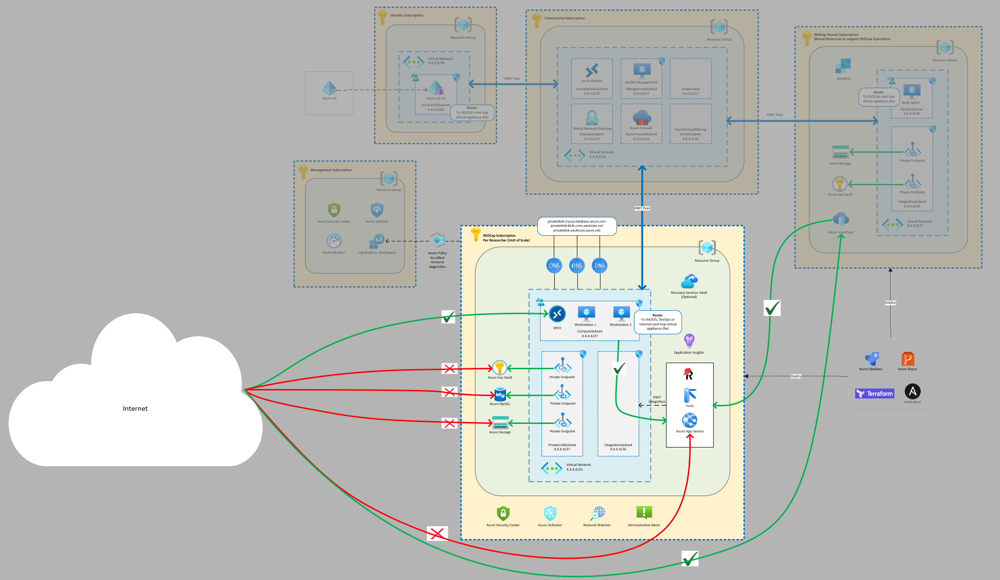

# Secure REDCap on Azure

This repo will deploy REDCap on Azure using Terraform. The Terraform configuration will provision all the infrastructure with necessary security controls in place. This repo assumes you have a hub/spoke network topology in place in Azure and this REDCap deployment will be a spoke within your overall Azure architecture. Once the infrastructure has been provisioned, you will need to establish a virtual network peering from the hub virtual network back to the REDCap virtual network and deploy source code to get the application up and running. From there, you can run the Ansible playbook (inventory file gets generated as part of this deployment) to configure Azure Virtual Desktop (AVD) session hosts which is going to be used as our secure entry points to the REDCap backend system. The front end of REDCap (i.e., survey URLs) will be accessible through the Azure Front Door service.



> This repo does not include any REDCap shared services such as Azure FrontDoor or SendGrid. That needs to be managed from a separate repository.

## Prerequisites

Before you begin, make sure you have the following:

- Understanding of and/or experience with [Terraform on Azure](https://docs.microsoft.com/en-us/azure/developer/terraform/)

- Implementation of [Azure Enterprise Scale Landing Zones](https://docs.microsoft.com/en-us/azure/cloud-adoption-framework/ready/enterprise-scale/architecture)
  - To keep consistent with Terrafrom tooling, you may want to implement this [Azure/caf-enterprise-scale](https://registry.terraform.io/modules/Azure/caf-enterprise-scale/azurerm/latest) module for ESLZ

- As part of Azure Landing Zone architecture, you should have [Hub/Spoke network topology](https://docs.microsoft.com/en-us/azure/architecture/reference-architectures/hybrid-networking/hub-spoke?tabs=cli).
  - The hub virtual network (VNET) should have to have an [Azure Firewall](https://azure.microsoft.com/en-us/services/azure-firewall/) or 3rd party Network Virtual Applicance (NVA) in place.
  - If your Active Directory Domain Controller or [Azure AD Domain Services](https://docs.microsoft.com/en-us/azure/active-directory-domain-services/overview) is in another spoke network, you'll need to have proper [User Defined Routes (UDR)](https://docs.microsoft.com/en-us/azure/virtual-network/virtual-networks-udr-overview) in place to ensure transitive networking is enabled from the REDCap spoke networks and the AD servers.

- Azure Storage Account or Terraform Cloud to store your remote state files.

  > Once you have these in place, update the `backend.tf` file to include your backend implementation

- REDCap Community site credentials which the deployment automation will use to pull your copy of the REDCap source directly from the community site.

  > NOTE: These values will be stored within the Azure Key Vault and the values will not be displayed within the Azure App Service configuration settings.

- Virtual Network address allocation for the REDCap resources and divided into Subnets. Here are the minimum CIDR ranges you'll need:

  > The deployment relies on the subnet names listed below. If you decide to change these, make sure you replace all instances in `main.tf`.

  - `/25` for the virtual network
  - `/27` for `PrivateLinkSubnet`
  - `/27` for `ComputeSubnet`
  - `/26` for `IntegrationSubnet`

- DNS IP address(es) for domain joining virtual machines (for AVD).

- Firewall IP address for configuring UDRs.

  > Make sure your firewall is configured to allow traffic to pass from and to the REDCap virtual networks. See [this link](https://docs.microsoft.com/en-us/azure/firewall/tutorial-firewall-deploy-portal#configure-a-network-rule) if you are using Azure Firewall.

- VNET peering information. More on vnet peering [here](https://docs.microsoft.com/en-us/azure/virtual-network/virtual-network-peering-overview).

  > The Terraform configuration in this repo will perform the one-way peer from REDCap to your hub virtual network.

- Route table (UDR) routes.

  > Hub/Spoke topology means you may be relying on resources that are deployed in another spoke vnet within your overall network topology. If resources are in a spoke vnet, you'll need to send the traffic to the firewall in the hub for spoke-to-spoke transit networking. More on vnet traffic routing [here](https://docs.microsoft.com/en-us/azure/virtual-network/virtual-networks-udr-overview).

## Naming conventions

The resources provisioned using this repo will be named using the naming conventions as outlined in the Cloud Adoption Framework. See this [link](https://docs.microsoft.com/en-us/azure/cloud-adoption-framework/ready/azure-best-practices/resource-naming) for more info

## Workspaces

In order to maintain multiple REDCap deployments with this repo, a decision was made to manage each deployment config using `.tfvars` files and [terraform workspaces](https://www.terraform.io/docs/language/state/workspaces.html#when-to-use-multiple-workspaces). Terraform workspaces will allow you to keep all deployment state information in a single storage account but logically separated using workspaces. With each deployment, you'll need to ensure you are selecting the right workspace and using the right .tfvars file. This can get difficult to manage and there's a high possibility of human error.

The alternative would be to create branches for each deployment but managing code changes between branches can become cumbersome over time as well.

## So, what get's deployed?

- [Azure Monitor alerts](https://docs.microsoft.com/en-us/azure/azure-monitor/alerts/alerts-overview) to satisfy [Azure HIPAA compliance policies](https://docs.microsoft.com/en-us/azure/governance/policy/samples/hipaa-hitrust-9-2).
- [Azure Virtual Network](https://docs.microsoft.com/en-us/azure/virtual-network/virtual-networks-overview) with [service endpoints](https://docs.microsoft.com/en-us/azure/virtual-network/virtual-network-service-endpoints-overview) enabled for Key Vault, Storage, Sql, and Web and a subnet delegation for App Service Vnet integration.
    > Virtual network peering will also be made to hub (one way) but peer from hub to REDCap is not in scope here. Also, route table routes will be added to send traffic for internet and AD to the firewall but routes coming back to REDCap is not in scope here either. You will need to manage these in another repo or via Azure Portal.
- [Azure Private DNS](https://docs.microsoft.com/en-us/azure/dns/private-dns-overview) zones for blob, mysql, and keyvault.
    > The decision was made to deploy private DNS zones and linked to the REDCap virtual network as opposed to the hub virtual network which is more common. The reason for this was to reduce the network dependency (other than the hub peering) and not allow the REDCap resources to be resolvable within the rest of the network topology.
- [Azure Storage Account with private endpoint](https://docs.microsoft.com/en-us/azure/storage/common/storage-private-endpoints) and service endpoints enabled (general purpose) to store survey data.
- [Azure Storage Account with private endpoint](https://docs.microsoft.com/en-us/azure/storage/common/storage-private-endpoints) and service endpoints enabled (premium files) to mount as a shared drive in the secure workstation.
- [Azure Key Vault with private endpoint](https://docs.microsoft.com/en-us/azure/key-vault/general/private-link-service) and service endpoints enabled to store application secrets. Access policies will be configured for AppService to be able to read secrets.
- [Azure Database for MySQL with private endpoint](https://docs.microsoft.com/en-us/azure/mysql/concepts-data-access-security-private-link) enabled and service endpoints.
- [Azure App Service](https://docs.microsoft.com/en-us/azure/app-service/overview) to host [REDCap application](https://www.project-redcap.org/). This service will be [vnet integrated](https://docs.microsoft.com/en-us/azure/app-service/web-sites-integrate-with-vnet) and have [network access restrictions](https://docs.microsoft.com/en-us/azure/app-service/app-service-ip-restrictions) in place to NOT allow any incoming traffic from any source except the ComputeSubnet (from secure WVD workstations), IntegrationSubnet, or [Azure FrontDoor](https://azure.microsoft.com/en-us/services/frontdoor/). 
    > The client IP of whereever you are running the terraform from is included only for testing purposes. Be sure to remove the configuration in a production deployment.
- [Azure Application Insights](https://docs.microsoft.com/en-us/azure/azure-monitor/app/app-insights-overview) for app monitoring
- [Windows Virtual Desktop](https://docs.microsoft.com/en-us/azure/virtual-desktop/overview) to provide secure computing environment to pull survey data and perform data analysis.
- [Windows Virtual Machines](https://docs.microsoft.com/en-us/azure/virtual-machines/windows/overview) with [Windows Virtual Desktop Agents](https://docs.microsoft.com/en-us/azure/virtual-desktop/agent-overview) installed to register as WVD Session Hosts
    > The virtual machines will have the following extensions installed: [DependencyAgent](https://docs.microsoft.com/en-us/azure/virtual-machines/extensions/agent-dependency-windows), [IaaSAntimalware](https://docs.microsoft.com/en-us/azure/virtual-machines/extensions/iaas-antimalware-windows), and [WinRM (for Ansible)](https://docs.ansible.com/ansible/latest/user_guide/windows_winrm.html) installed via [Custom Script Extension](https://docs.microsoft.com/en-us/azure/virtual-machines/extensions/custom-script-windows).
- [Azure Recovery Services Vault](https://docs.microsoft.com/en-us/azure/backup/backup-azure-recovery-services-vault-overview) with [VM Backup Policy](https://docs.microsoft.com/en-us/azure/backup/backup-azure-manage-vms) and [Azure Files backup policy](https://docs.microsoft.com/en-us/azure/backup/backup-afs).
- [Ansible inventory file](https://docs.ansible.com/ansible/latest/network/getting_started/first_inventory.html) which you can use to run the `site.yml` playbook against
    > Ansible playbook will perform the actions of [downloading and installing the WVD agents](https://docs.microsoft.com/en-us/azure/virtual-desktop/create-host-pools-powershell#register-the-virtual-machines-to-the-windows-virtual-desktop-host-pool) and joining the VM to your domain.

## Provisioning REDCap Infrastructure

1. Create a new `.tfvars` file and drop into the `workspaces` directory.

    - The name of your `.tfvars` file and the `terraform workspace` will need to be the same.

1. Execute the `terraform plan` and `terraform apply` commands and pass in your `.tfvars` file in the `-var-file` parameter.

    - You will be required to enter the local VM username and password and the REDCap zip file URL.

1. After the resources have been provisioned, you'll need to create a vnet peering back from the hub vnet to the REDCap's vnet.

    - This codebase will only apply one half of the peering (from REDCap vnet to the Hub).

1. Next, deploy the source code from the github repo

    - The command to deploy the source is in the `terraform output` as `deploy_source`

## Configure REDCap WVD Workstations

Configuration of secure workstations will be automated using Ansible. The `site.yml` [Ansible Playbook](https://docs.ansible.com/ansible/latest/user_guide/playbooks.html) found in this repo relies on a few variables needed to  domain join your virtual machines. Rather then saving credentials to the repo (never a good thing) we'll use `ansible-vault` to encrypt contents leveraging [Ansible Vault](https://docs.ansible.com/ansible/latest/user_guide/vault.html) and pass in a `secrets.yml` file on the ansible-playbook run.

Let's start by creating a vault file:

```sh
ansible-vault create secrets.yml
```

Type in a new vault password and enter the following contents:

> You're using `vi` here so make sure you hit the `i` key be in `insert` mode

```sh
dns_domain_name: <YOUR_DOMAIN_NAME>
domain_admin_user: <YOUR_DOMAIN_JOIN_USER>
domain_admin_password: <YOUR_DOMAIN_JOIN_PASSWORD>
domain_ou_path: <YOUR_DOMAIN_OU_PATH>
```

> Save the file using the following command `:wq`

The file `secrets.yml` needs to be saved to your repository or downloaded as a secure file within your pipeline.

To use view the ansible vault file you'll need to enter the vault password to decrypt the contents. However, in a pipeline scenario, you will not have the opportunity to enter the pipeline at runtime, but you can use a file and point the ansible-vault to that. This is the approach we'll use for the pipeline.

Create a `vaultpass` file.

```sh
echo '<YOUR_ANSIBLE_VAULT_PASSWORD>' > vaultpass
```

To ensure you did all this properly, you can use the `view` subcommand of `ansible-vault`. This will decrypt the vault and display the contents you entered.

```sh
ansible-vault view secrets.yml --vault-password-file vaultpass
```

If all looks good, be sure the variable names aligns with the variables we'll use in our playbook. When you are ready to run the playbook, you will run it by passing in additional variables from your `secrets.yml` file. This will be denoted using the `-e` flag and since we are referencing a file, you'll need to add the `@` symbol in front of the file name

```sh
ansible-playbook -i inventory-sample2 -e @secrets.yml --vault-password-file vaultpass site.yml
```

**Resources:**

- [Encrypting content with Ansible Vault](https://docs.ansible.com/ansible/latest/user_guide/vault.html)
- [Handling secrets in your Ansible playbooks](https://www.redhat.com/sysadmin/ansible-playbooks-secrets)

## Deleting REDCap

- If you have deployed a Recovery Services Vault, you'll need to make sure to stop and delete your VM and file share backups, unregister your storage account from Backup Infrastructure, and remove the management lock on the resource group before running the `terraform destroy` command.
- Be sure to delete the vnet peering from the hub to the REDCap instance
- Be sure to delete the `terraform workspace`

## Azure DevOps Pipeline

This repo comes with an `azure-pipelines.yml` file. To use it, you'll need to setup a [Variable Group](https://docs.microsoft.com/en-us/azure/devops/pipelines/library/variable-groups?view=azure-devops&tabs=yaml) and add the following secrets. Ideally you will be storing these values in [Azure Key Vault](https://docs.microsoft.com/en-us/azure/devops/pipelines/library/variable-groups?view=azure-devops&tabs=yaml#link-secrets-from-an-azure-key-vault) and using that to link secrets:

- `client-id` - used by terraform
- `client-secret` - used by terraform
- `tenant-id` - used by terraform
- `main-subscription-id` - this is the id of the subscription where your storage account where remote state file lives
- `local-vm-username` - this will passed dynamically to the terraform apply command
- `local-vm-password` - this will passed dynamically to the terraform apply command
- `redcapzip` - this is the publically accessible (yet secure) URL to your REDCap zip file
- `ansible-vault-password` - this is used to decrypt your ansible-vault without being prompted for a password

You should also provision a small Linux VM in your REDCap shared services subscription and install the self-hosted [Azure DevOps Build Agent](https://docs.microsoft.com/en-us/azure/devops/pipelines/agents/v2-linux?view=azure-devops) software on it. This way, you will be able to use your build machine to invoke the Ansible playbook against the new session host VMs using private IP addresses within your Azure virtual network.

Alternatively, if you do not want to manage another VM, you can follow this [guide](https://pauldotyu.github.io/azure-pipeline-agent/) to run an Azure DevOps Build Agent in a container using Azure Container Instances within your virtual network.

Lastly, add pipeline variables called `notifyUsers` and `workspace` that can be [set at queue time](https://docs.microsoft.com/en-us/azure/devops/pipelines/process/variables?view=azure-devops&tabs=yaml%2Cbatch#allow-at-queue-time).